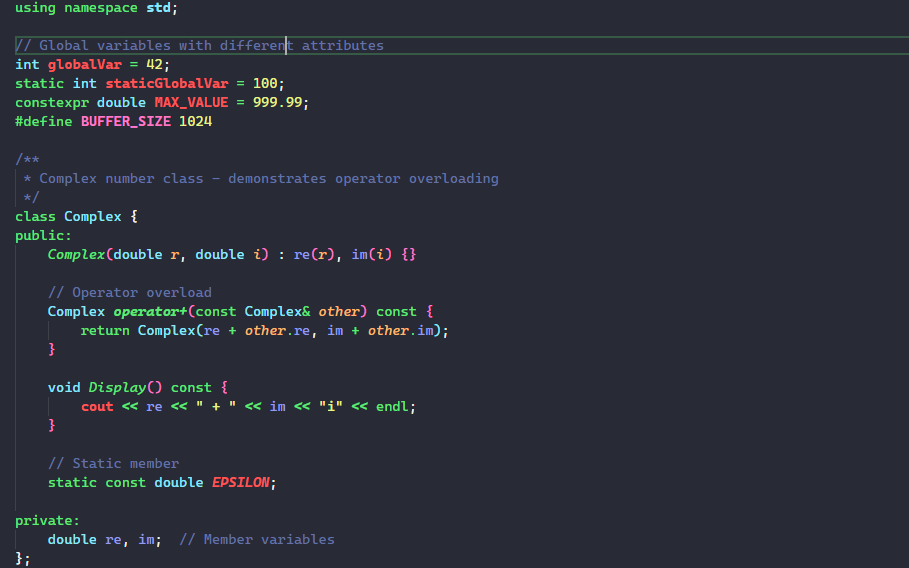

# C/C++ Pro Theme for VS Code

[](https://github.com/xenkuo/ccpp_theme)
[](LICENSE)

**A professional theme dedicated to C/C++ developers**, leveraging VS Code's semantic highlighting engine to provide fluent, systematic syntax highlighting.


## Features

🎯 **Enhanced Semantic Highlighting**  
Utilizes VS Code's powerful semantic highlighting engine to recognize more token types and provide accurate syntax highlighting for C/C++ code.

🎨 **Dual Theme Support**  
- **Dark Theme**: Based on [Dracula Official](https://marketplace.visualstudio.com/items?itemName=dracula-theme.theme-dracula)
- **Light Theme**: Based on [Bluloco Light](https://marketplace.visualstudio.com/items?itemName=uloco.theme-bluloco-light)

⚡ **Multi-LSP Compatibility**  
Supports both **MS C/C++** and **clangd** Language Server Protocols, providing consistent rendering results across different toolchains.

🔧 **Opinionated Design**  
Recognizes extensive C/C++ syntax symbols and renders them thoughtfully with built-in design principles.

### Enhanced Semantic Highlighting Demo



*The example above showcases how C/C++ Pro Theme highlights different C++ constructs:*
- 🟦 **Global/Static variables** - distinct colors for different scopes
- 🟩 **Operators** - clear distinction between `=`, `==`, `&&`, `&`
- 🟨 **Class members** - properties, methods, and static members
- 🟪 **Templates** - type parameters and specializations
- 🟧 **Smart pointers** - modern C++ features
- ⬛ **Enums and macros** - enhanced visibility

**Want to see it in action?** Open [`sample/screenshot-sample.cpp`](sample/screenshot-sample.cpp) in your VS Code with C/C++ Pro Theme activated!

## Design Principles

### 1. Priority Design
- **Scope** has highest priority
- **Type** comes second
- **Attributes** (readonly, declaration, etc.) follow

### 2. Consistency Design
- ✅ Similar concepts share visual similarities (e.g., static variables resemble global variables)
- ✅ Consistent experience between C and C++
- ✅ Unified rendering across MS C/C++ and clangd LSPs
- ✅ Maintains harmony with base [Dracula Official](https://github.com/dracula/visual-studio-code.git) theme colors

### 3. Style Guidelines
- Uses `underline` style sparingly for special tokens (e.g., static variables/functions)
- Thoughtful color choices from established theme palettes

## FAQ

### Q: What's the difference between MS C++ and clangd extensions?

Both are excellent C/C++ Language Server implementations:

- **clangd**: Offers more precise token types (especially for `variable` and `function`), generally faster performance
- **MS C/C++**: Provides more appropriate token sets and better compatibility based on daily usage experience

The theme aggregates semantic tokens from both LSPs into a uniform rendering, so you can use either or switch between them seamlessly.

## Installation

1. Download the `.vsix` file from the [Releases](https://github.com/xenkuo/ccpp_theme/releases)
2. Open VS Code
3. Press `Ctrl+Shift+P` (or `Cmd+Shift+P` on macOS)
4. Select **"Extensions: Install from VSIX..."**
5. Choose the downloaded `.vsix` file
6. Activate the theme: `Ctrl+K Ctrl+T` → Select **"C/C++ Pro Theme"** or **"C/C++ Pro Theme Light"**

## Usage

After installation, activate the theme:
- **Dark Theme**: Press `Ctrl+K Ctrl+T` → Select **"C/C++ Pro Theme"**
- **Light Theme**: Press `Ctrl+K Ctrl+T` → Select **"C/C++ Pro Theme Light"**

For best results, ensure semantic highlighting is enabled in VS Code settings.

## Development

Want to contribute or customize the theme? Check out our [Development Guide](./docs/Develop.md) for:
- Quick start instructions
- Build system overview
- Packaging guidelines
- Development workflow

### Quick Start

```bash
# Clone the repository
git clone https://github.com/xenkuo/ccpro_theme.git

# Navigate to project directory
cd ccpro_theme

# Build the theme
npm run build

# Test in VS Code
# Press F5 to launch Extension Development Host
```

## License

This project is licensed under the terms specified in the [LICENSE](LICENSE) file.

## Acknowledgments

- Dark theme based on [Dracula Official](https://github.com/dracula/visual-studio-code.git)
- Light theme based on [Bluloco Light](https://github.com/uloco/bluloco)
- Built with ❤️ for the C/C++ community
 